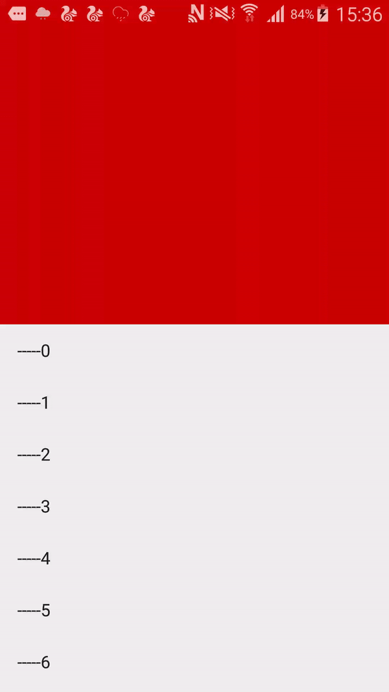

on nested view scrolled up the first view also scroll to up at the same time, and when it will stoped 
to scroll up when the left height of first view is equal to  the second view's height. and the second view
will show then.
第一个View滑动到剩下的距离是第二个view的高度时候，显示第二个View。
我这个例子只是用一个普通的View，用颜色区分，可以是任何View。我写这个的目的是说
nest scroll view滑动时候，联动到另外一个View的显示很隐藏，我是准备做周、月切换的，类似的逻辑会用到
这种效果，我把他单独拿出来了。大家可以根据此来替换这两个View。内部也可以是RecyclerView 或者
NestedScrollView.

qq:659316961
# 效果图(effect screen)

